<div align="center">

# flow-gatekeeper

**即時流程監控 × 串流式 AI 診斷面板 — 一個致敬 Argo CD 的高頻 WebSocket 工程展示**

以 buffer + `requestAnimationFrame` 每幀批次提交壓制高頻遙測、以獨立 worker + BullMQ + Redis 削峰 AI 診斷，
並把「背壓比值」與「逐字串流的 AI 推理」直接畫在同一個畫面上——
再把整套系統做進**受監督的容器**、補齊**崩潰自癒**與**可觀測性基線**，讓它不只是能跑，而是禁得起斷線、崩潰與被監控。

<br/>


</div>

---

## 端到端操作 Demo（實機錄影）

> 不想自己 `docker compose up` 也能感受這個系統跑起來的樣子——以下是**對正在跑的一鍵 demo 容器**（`docker compose --profile demo up -d --build` → `http://localhost:8080`）用 Playwright 腳本化操作、原始無剪接錄下的 22 秒全程，**非後製動畫**：

<div align="center">

<video src="docs/demo/flow-gatekeeper-demo.mp4" controls muted playsinline poster="docs/demo/flow-gatekeeper-demo-poster.jpg" width="100%">
  你的檢視器不支援內嵌影片播放，可直接開啟
  <a href="docs/demo/flow-gatekeeper-demo.mp4">docs/demo/flow-gatekeeper-demo.mp4</a>。
</video>

</div>

| 時間 | 畫面 |
| --- | --- |
| 0:00 | 監控台全景：5 台機台即時遙測、`BackpressureBadge` 比值持續累積 |
| 0:05 | TopBar search 即時過濾 sidebar 與卡片 |
| 0:07 | 點選 `press-02`（此刻已轉 critical）→ 按 **Diagnose** |
| 0:08–0:15 | Copilot drawer 進入 **Active**：任務 meta、處理步驟清單、AI 回覆**逐字串流**（畫面凍結於 68% 時可見 JSON 逐段浮現） |
| 0:16 | **Completed**：結構化結果（Summary／Likely Causes／Evidence），此次**非快取**——真的呼叫了一次 Gemini |
| 0:19–0:22 | 對同一台再按一次 Diagnose → 秒回並標示 **Cached**（cache-aside + dedupe lock 的可視化證據） |

> 錄製方式：本機清空 `ai-cache:*`／`ai-lock:*` 後，用 Playwright 對著跑在容器裡的真實全棧（api／worker／web／Redis／MongoDB，AI 由 Gemini 2.5 Flash 即時回覆）做一次腳本化操作並錄影，全程無手動剪輯或字卡。想自己重現，見下方「[快速開始](#快速開始)」。

---

## 目錄

- [端到端操作 Demo（實機錄影）](#端到端操作-demo實機錄影)
- [專案概述](#專案概述)
- [專案亮點](#專案亮點)
- [功能逐項展示（實機截圖）](#功能逐項展示實機截圖)
- [技術亮點深入](#技術亮點深入)
- [系統架構與資料流](#系統架構與資料流)
- [技術棧](#技術棧)
- [資料模型](#資料模型)
- [功能導覽（依 feature 逐一交付）](#功能導覽依-feature-逐一交付)
- [Monorepo 結構](#monorepo-結構)
- [快速開始](#快速開始)
- [執行模式：開發模式與一鍵 demo](#執行模式開發模式與一鍵-demo)
- [環境變數](#環境變數)
- [測試與品質門檻](#測試與品質門檻)
- [開發方法論：Spec-Driven Development](#開發方法論spec-driven-development)
- [關鍵架構決策（ADR）](#關鍵架構決策adr)
- [已宣告的取捨](#已宣告的取捨)
- [已知限制](#已知限制)

---

## 專案概述

**flow-gatekeeper** 是一個模擬工廠機台艦隊（fleet）的即時監控台：5 台示範機台以 10–50ms 的節拍持續吐出遙測（溫度、振動、吞吐、錯誤率），前端即時渲染每台的健康狀態；當某台轉為 warning／critical 時，操作者可以**就地對那台機台觸發一次 AI 診斷**，並在同一畫面的 Copilot 面板中，看著 AI 的推理**逐字串流**出現，最後收斂成一份結構化診斷（嚴重度、可能原因、佐證、建議動作）。

它的定位不是「把即時通訊接起來」而已，而是刻意親手實作即時／分散式系統裡**較難、較有展示價值的那幾塊**，並把整個系統一路做到「能被單一指令跑起來、崩潰能自癒、自己也能被監控」的程度：

- **資料面**：前端高頻背壓、跨進程串流 relay、佇列削峰、cache-aside 去重、契約優先的全棧型別安全（Feature 001–006）。
- **運維面**：worker/api/web 的 process 監督與 let-it-crash 崩潰語意、整棧一鍵容器化、結構化日誌與健康探針／關鍵指標的可觀測性基線（Feature 007–009）。

前半段回答「這個系統怎麼把資料正確、即時地流過去」，後半段回答「這個系統怎麼在無人值守時活下來、又怎麼讓人看見它活得好不好」——兩段合起來才是完整的工程紀律展示，而不只是一個能連線的 demo。整個專案以 [GitHub Spec Kit](https://github.com/github/spec-kit)（Spec-Driven Development）逐 feature 開發，工程原則以 `.specify/memory/constitution.md`（專案憲章）為準；重大跨 feature 的技術取捨另記錄於 `docs/adr-*.md`（見下方「[關鍵架構決策（ADR）](#關鍵架構決策adr)」）。

**一分鐘看懂資料怎麼流**：前端面對 10–50ms 級的 WebSocket telemetry，不逐筆寫 reactive state，而是先進 buffer、再以 `requestAnimationFrame` 每幀批次提交，藉此穩住畫面；後端以 NestJS Gateway 承接 WebSocket，並把耗時的 AI 診斷交給 BullMQ 丟進獨立 worker，避免阻塞主服務。worker 本身沒有前端連線，AI token 因此改走 Redis Pub/Sub 回到 Gateway、再轉送前端；資料層由 MongoDB 保存 telemetry、errorlogs、maintenanceRecords 與 diagnoses，Redis 則負責 queue、cache、Pub/Sub 與 dedupe lock。這一整套資料流本身跑在**三個受監督的容器**裡（api／worker／web，`docker compose --profile demo`），任一行程非預期崩潰即由 restart policy 拉起乾淨行程；三端同時把結構化日誌、健康探針與關鍵指標（queue 深度、WS 連線數、LLM latency、cache 命中率）往外送，讓「這套系統本身是否健康」也是一個**畫得出來、查得到**的問題，而不必登進容器看 stdout 猜測。整個開發流程以 Spec Kit 的 constitution / spec / plan / tasks / implement 管理，每條 feature 都帶可驗收條件。

> 本專案重點在於**工程紀律的可驗證性**——每個賣點都有對應的量化驗收（SC）與可重播 demo。

---

## 專案亮點

| 亮點 | 一句話 | 佐證 |
| --- | --- | --- |
| ⚡ **高頻 WebSocket 背壓** | telemetry 先進 buffer、`requestAnimationFrame` 每幀批次提交，**不逐筆寫 reactive state** | 畫面上直接顯示 `收到訊息數 : 渲染批次數` 比值（50ms 節拍約 11:1，節拍越快比值越高） |
| 🔌 **原生 `ws`，不用 Socket.IO** | 前端 `new WebSocket()`／後端 `ws` 掛在 NestJS，完全掌控 wire format | 決策取捨見 [ADR-001](docs/adr-001-native-websocket.md) |
| 🧵 **跨進程 AI 串流 relay** | worker 不直接 emit WS；AI token 走 Redis Pub/Sub → Gateway 轉發到對應連線 | 單一 WebSocket 連線同時承載遙測與診斷串流 |
| 🚦 **佇列削峰 + 韌性** | BullMQ + Redis：rate limit（`AI_RPM`）、`attempts` 重試、指數退避、worker 崩潰不拖垮 API | 20 筆並發診斷不超過每分鐘 LLM 上限 |
| 💰 **Cache-aside + dedupe lock** | 相同機台／狀態簽章直接回快取、`ai-lock:<sig>` 讓同情境只打一次 LLM | 第二次同類診斷秒回並標 `Cached` |
| ✅ **Schema 驗證的 AI 輸出** | AI 回傳必經 `DiagnosisResultSchema.parse()`，失敗走 `ai/error`，不把未驗證物件當結果 | Zod 為單一真實來源，型別由 `z.infer` 推導 |
| 📐 **契約優先的全棧型別安全** | web／api／worker 三端共用 `packages/contracts` 同一份事件／結果型別 | strict TypeScript、`asyncapi.yaml` 契約 lint |
| 🤖 **每機台狀態機的 Copilot Drawer** | `Map<machineId, CopilotJobState>`：多台可並存診斷，切換選取即還原各自呈現 | idle／active／streaming／completed／failed 五態 |
| 🩺 **let it crash + process 監督** | worker／api 崩潰語意從「log + 續跑」翻成 `exit(1)` 交監督者以乾淨行程重啟，不再帶著未定義狀態硬撐 | Redis heartbeat key 偵測「活著但卡住」；連續失敗 5 次即停止重啟，防崩潰迴圈打爆 LLM 額度——見 [ADR-002](docs/adr-002-productionization-scope.md) |
| 📦 **整棧容器化 + 單一入口** | `docker compose --profile demo up -d --build` 起 api／worker／web 三端受監督容器，瀏覽器只面對單一入口 | nginx 同源反代 `/ws`、`/diagnoses`；`down -v` 可乾淨重設、劇本可重播 |
| 🔭 **可觀測性基線** | 三端補齊結構化 JSON 日誌（pino）、`GET /healthz` 依賴探針、queue 深度／WS 連線數／LLM latency／cache 命中率週期入 log 並廣播 `system/metrics` | 「這個專案本身是監控台，但它自己也該可被監控」——dev-only Metrics Panel 即時顯示這些數字 |

---

## 功能逐項展示（實機截圖）

> 以下皆為**實際執行中的 app 截圖**（前端 Vue + 後端 NestJS Gateway + 獨立 worker + Gemini 全棧跑起來後擷取），逐一對應每個可操作的功能。視覺規格單一來源另見 [`apps/web/design/`](apps/web/design/)（design-spec 與 refs）。

### 1. 即時 fleet 監控台全景 + 背壓量化

打開應用**第一屏即是可操作的監控台**（非 landing page），自動連上 `/ws` 並訂閱 5 台示範機台。整個監控台一次到位：左側 sidebar 依機台群組分區（**Prep／Forming & Baking／Fulfilment**）並在左下以 **Fleet Health** 面板把全隊狀態聚合成 healthy／warning／critical／stale 計數與比例條；主區頂部是「**Fleet monitor · N machines**」標題列，其下為機台卡片（狀態文字徽章、帶單位的遙測、`updated Ns ago` 相對時間戳）；主區底部是 **Event Stream**，記錄最近的門檻跨越／錯誤事件。頂部工具列的 **BackpressureBadge** 即時顯示 `收到訊息數 · 渲染批次數 · 比值`（此例約 `505 msgs · 101 frames · 5:1`，節拍越快比值越高）——把「收很多、只批次渲染少數幾次」的削峰效果直接畫在畫面上，不用開 DevTools；一旁還有 pause／resume、connection chip（含延遲毫秒）與 search。右側為桌機常駐的 AI Copilot 面板（未選機台時為空狀態提示）。

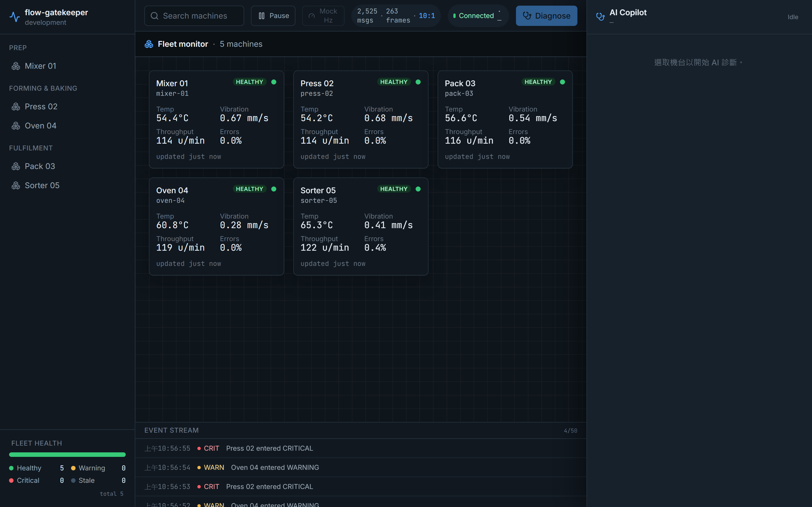

### 2. 機台狀態呈現：healthy / warning / critical

每張卡片固定 footprint，狀態切換只改**狀態文字徽章**（HEALTHY／WARNING／CRITICAL）、狀態燈與遙測顏色，**不造成 layout shift**；狀態**不只靠顏色**（徽章帶文字、狀態燈帶 `aria-label`）。下圖三態同屏：`press-02` 進入 critical（紅色徽章、紅色卡片 tint、越界的 Temp `92.1°C`／Vibration `2.50 mm/s`／Errors `16.0%` 一併轉紅），`oven-04` 為 warning（**越界數值本身染 amber**，如 Vibration `1.13 mm/s`、Errors `6.0%`，而卡片**邊框維持 subtle**、不額外加粗），其餘維持 healthy。左下 Fleet Health 同步反映 `Healthy 3 / Warning 1 / Critical 1`（比例條按佔比著色），Event Stream 也各記一筆狀態轉換。遙測由 mock producer 以決定性規律產生，內含週期性 warning／critical 尖峰，確保 demo 可重播。

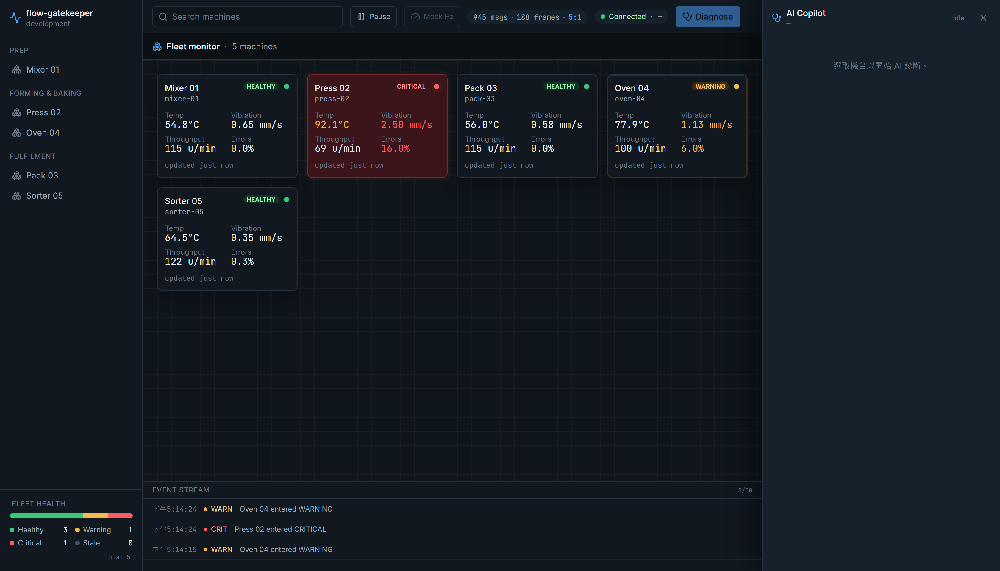

### 3. Fleet Health 聚合面板

sidebar 左下的 **Fleet Health** 面板把全隊狀態即時聚合成 **healthy／warning／critical／stale** 四類計數與一條比例條，讓操作者不必逐張數卡片就掌握整體健康度。作為不變量，四類計數之和**恆等於**納入統計的機台總數（stale 亦計入 total）；比例條依佔比著色、隨遙測每批次更新，並與各卡片當下狀態一致（下圖凍結於 `4 healthy · 1 warning` 的瞬間，比例條同步分成綠／琥珀兩段）。stale 沿用 004 的 `isStale` 判定（預設 10s 未更新即歸此類）。

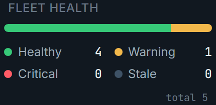

### 4. Event Stream 事件列

主區底部的 **Event Stream** 列出最近的**門檻跨越／錯誤**事件，每筆含時間、機台、嚴重度（WARN／CRIT）與可讀短訊息，讓操作者回顧「剛剛哪台、何時、發生了什麼」。事件**只在狀態轉換時記一筆**（同一狀態內的數值抖動不會重複灌爆），並保留**最近 50 筆**上限（超過即淘汰最舊、不無限成長）。這條事件流是**前端衍生**的——由既有 telemetry 在 state 轉換時就地產生，不新增任何 `packages/contracts` 事件、也不加後端負擔。

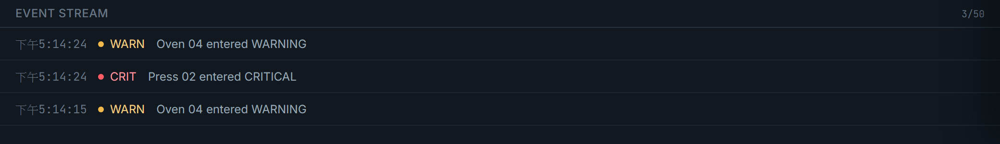

### 5. sidebar 機台分組 + 即時 search 過濾

sidebar 依前端**靜態對照**把機台分成 **Prep／Forming & Baking／Fulfilment** 三組呈現（每組一標題，對照缺項的機台落入 fallback 群組而非漏顯示）。頂部 search 欄位則做**實際過濾**（非僅外觀）：輸入片段字串會**同時**收斂 sidebar 清單與主區卡片，比對鍵涵蓋 machineId 與顯示名稱（任一 `includes` 命中，空查詢回全部）。下圖輸入 `p` 後只剩 `Press 02` 與 `Pack 03`，而主區標題與 Fleet Health 仍以**全隊**為母數（過濾只影響呈現、不改統計）。

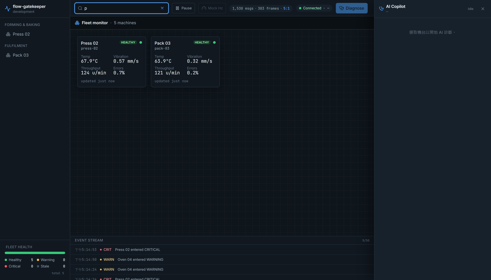

### 6. 機台選取（驅動診斷對象）

點選卡片或左側清單即設定 `selectedMachineId`（同時至多一台），以 accent 高亮呈現選取；這個選取就是 Diagnose 的作用對象。下圖選取了正處於 critical 的 `Press 02`（清單項與卡片皆高亮，紅色 tint 一併呈現於選取態），右側 Copilot 面板隨即帶出該台的即時摘要（State／Temp／Vibration／Errors）與 **Run diagnosis** 按鈕。

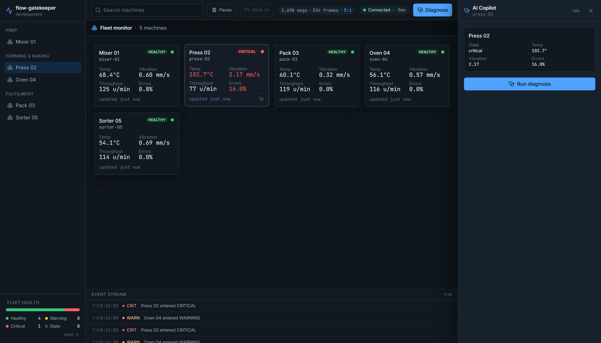

### 7. 斷線自動重連 + stale 標示

即時通道中斷時，頂部 connection chip 轉為 **Reconnecting** 並顯示「顯示最後已知資料」橫幅，以指數退避 + 抖動自動重連；期間**不清空**最後已知資料，而是把超過門檻（預設 10s）未更新的機台打上 **STALE** 標記、降低視覺權重，並讓卡片凍結在最後已知值（下圖 `press-02` 就停格在中斷前的 critical 讀數）。Fleet Health 同步把它們計入獨立的 **stale** 類（此例 stale=5，仍計入 total）。恢復連線後自動重新訂閱並繼續推送。

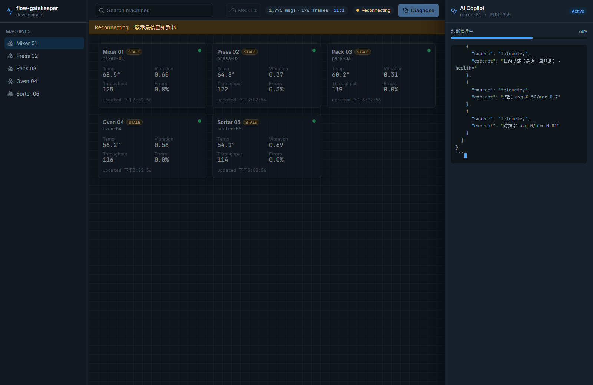

### 8. 觸發診斷 + 逐字串流

對選取機台按 **Diagnose**：前端帶著目前的 `socketId`（即 WS `clientId`）呼叫 `POST /diagnoses`，drawer **立即進入 active**（不等任何 AI 內容）。active 呈現忠實對映後端佇列設定——上方顯示任務 meta（Queue `diagnosis`、Concurrency `2`、Attempts `3`）與一份**處理步驟清單**（任務啟動 → 組建診斷 context → 取得去重鎖 → 接收首個 token → 解析結果成功 → 寫入並完成，依 `job/status` 進度里程碑 0/20/40/60/80/100 由待辦→進行中→已完成推進）；接著 worker 的 AI 推理 **逐段 append 出現並帶串流游標**，不必等整段生成完。此時右側 Copilot 面板明確標示對應機台（`press-02`）與任務短碼。

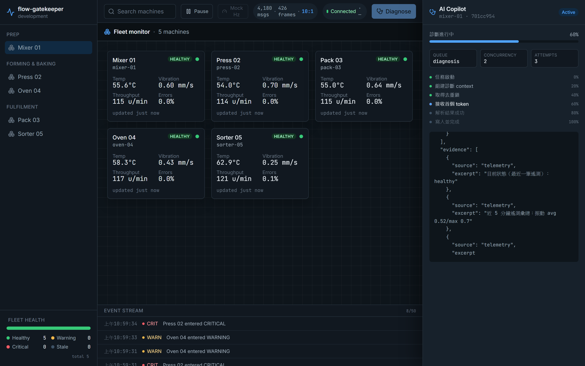

### 9. 結構化診斷結果（五區塊）

`ai/done` 抵達後，drawer 原地渲染**通過 `DiagnosisResultSchema` 驗證**的結構化結果，欄位一致無錯位：**Summary + 嚴重度徽章**（ok／warning／critical）、**Likely Causes**、**Evidence**（來源標記 telemetry／errorlog／maintenance 的佐證片段）、**Suggested Actions**（含 `priority` 與可選 `command`）。進度條走到 100%，先前串流原文收合可回看。

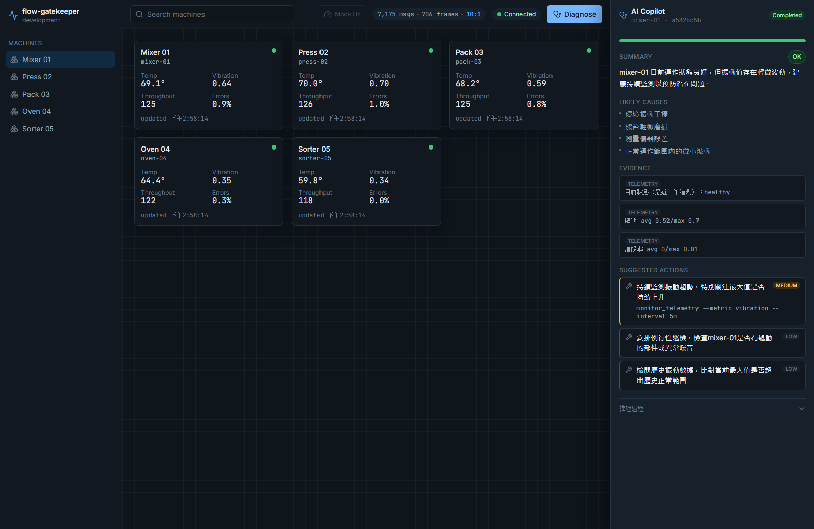

### 10. 快取命中標示（Cache before API）

對同一機台、同一狀態簽章再次診斷時，後端 cache-aside 直接回既有結果、**不再呼叫 LLM**，drawer 顯示 **Cached** 標記、進度直接 100%。這是 003「Cache before API / dedupe lock」在前端的可視化證據——demo 中可直接展示「第二次同樣診斷秒回且標為 cached」。

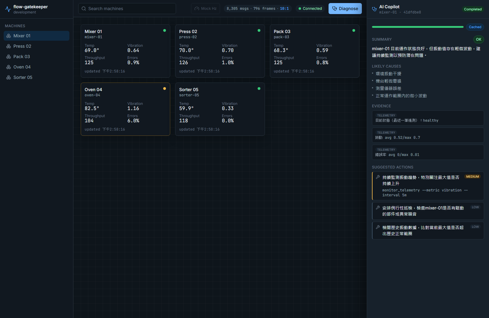

### 11. 失敗與重試

當診斷因 worker 停擺、AI 錯誤或連線中斷導致綁定失效時，drawer 進入 **Failed**，顯示**可讀的錯誤訊息**（非原始堆疊，如「連線中斷，請重試」）與一個 **Retry** 動作；按 Retry 對同機台重新發起診斷、回到 active 流程（若簽章相同命中快取則照常標 Cached）。

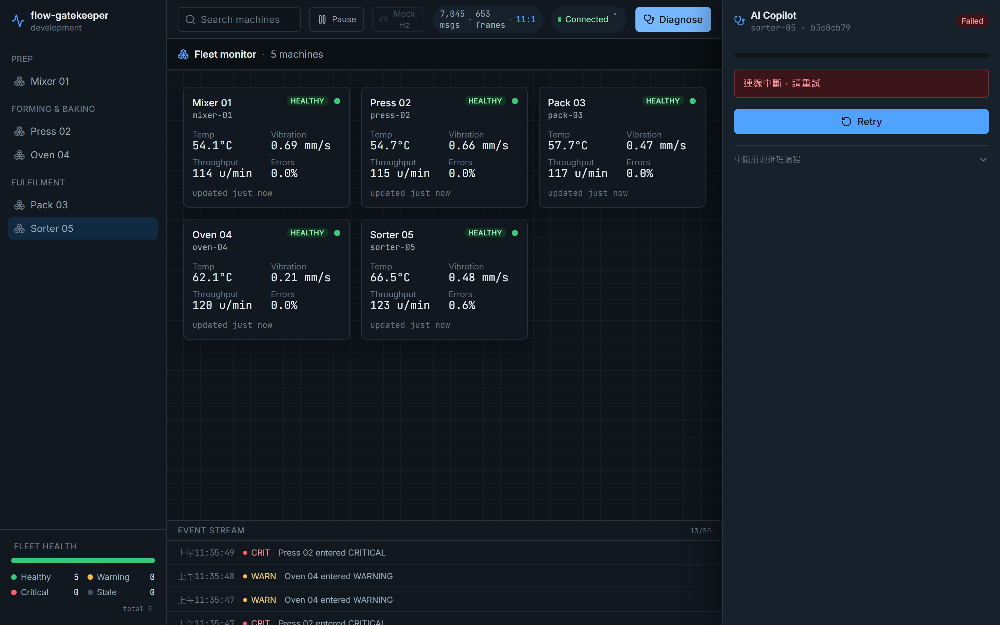

### 12. 響應式 / 手機 bottom-sheet

四個基準 viewport（1366×768／1440×900／768×1024／390×844）皆不溢出、不重疊、不遮住頂部狀態列。手機尺寸下卡片退化為**單欄清單**，Copilot 由右側常駐面板改為**底部 bottom-sheet**（選台即開啟、可上滑展開、可關閉、含 Escape）；下圖 bottom-sheet 內即為一份完整的結構化診斷（Summary + 嚴重度徽章、Likely Causes、Evidence、帶 priority 標籤的 Suggested Actions；`command` 為可選欄位，視 AI 回覆內容而定，桌機版 [copilot-completed.png](docs/screenshots/copilot-completed.png) 可見帶 command 的範例），在窄螢幕下仍欄位一致、可捲動閱讀。

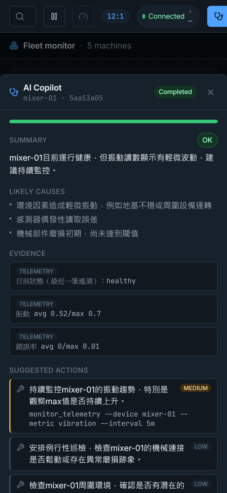

---

## 技術亮點深入

### ⚡ 1. 高頻遙測的前端背壓（本專案核心賣點）

遙測以 10–50ms 級湧入（5 台 × 每 tick 一筆）。若每筆都寫 reactive state，Vue 會被逼著逐筆重繪，畫面必卡。做法是：

```
WebSocket.onmessage ──▶ 只 push 進 buffer（不碰 reactive state）
                              │
        requestAnimationFrame ─┘ 每一幀 flush 一次 buffer ──▶ 批次提交到 store
```

- `useHighFrequencyWs` 的 `onmessage` **只**把訊息推進 buffer，絕不直接寫 reactive state（憲章硬規則 #1）。
- 每一幀（rAF）才把累積的 buffer 一次性提交，把「收 N 筆、只渲染 M 次」的削峰效果做出來。
- buffer 設**上限**（超過丟最舊、保最新），避免分頁切到背景時逐幀暫停、記憶體無限成長。
- store 維護 `receivedMessages` 與 `renderedBatches` 兩個計數，**把背壓從抽象說法變成畫面上看得見的比值**——這是整個決策最直接的證據。

### 🔌 2. 即時通道統一用原生 WebSocket

前端 `new WebSocket()`、後端 `ws` 套件掛在 NestJS HTTP server（path `/ws`）。刻意**不用 Socket.IO**：高頻場景需要 wire format 的完全控制（直接推裸 JSON 陣列、少一層封包開銷），也避免函式庫內部緩衝與自己的 rAF 批次策略打架、讓「背壓由誰負責」變模糊。代價（reconnect、heartbeat、訂閱表、jobId 對應）全部手刻並列入驗收。完整取捨見 **[ADR-001](docs/adr-001-native-websocket.md)**。

- **指數退避 + 抖動**重連（非使用者主動關閉才重連）。
- 應用層 `ping`/`pong` heartbeat + 逾時主動 `close` 觸發重連。
- 伺服器端主動探活，回收「半死」連線（網路硬中斷）。

### 🧵 3. 跨進程 AI 串流：Redis Pub/Sub relay

worker 是獨立 process、沒有前端連線，**不得直接 emit WebSocket**（憲章硬規則 #3）。因此：

```
worker ──publish── ai-stream:<jobId> (Redis Pub/Sub) ──▶ Gateway 訂閱 ai-stream:*
                                                              │
                                        依 Map<jobId, clientId> 轉發 ai/token/done/error
                                                              ▼
                                               對應的那一條前端 WebSocket 連線
```

- job **生命週期**（`job/status`）走 BullMQ QueueEvents；AI **token 串流**走 Redis Pub/Sub——**兩條流分開**，不混為一談（憲章原則 IV）。
- 診斷事件與遙測**共用同一條前端 WebSocket 連線**：004 的 `useHighFrequencyWs` 以 `onDiagnosisEvent` 回呼分流，`ai/token` 直接 append（人可讀低頻），**MUST NOT 混入遙測 buffer**，遙測的 rAF 批次背壓因此不被破壞。

### 🚦 4. 佇列削峰與失敗韌性（BullMQ + Redis）

- `POST /diagnoses` 只負責入列並立即回 jobId，**耗時工作全在獨立 worker**——API process 不做 long-running 診斷。
- BullMQ limiter：每分鐘實際 LLM 呼叫 ≤ `AI_RPM`（預設 8）；`concurrency`（預設 2）與 rate limit 是獨立維度。
- `attempts`（預設 3）+ 指數退避；單次 AI streaming 設 **30 秒**應用層逾時，逾時轉 `ai/error` 走重試。
- worker 崩潰／停擺時，API 與即時通道**不崩潰**；worker 恢復後積壓任務可被消化。

### 💰 5. Cache-aside + dedupe lock（成本守門）

- worker 呼叫 LLM **前**先以「機台／當前嚴重度／近期錯誤類型／prompt 版本／模型」組出的簽章查 Redis 快取（`Cache before API`，憲章硬規則 #5）。
- 命中直接回傳並標 `cached: true`，**不呼叫 LLM、不重複寫入 `diagnoses`**（只記一筆輕量觸發稽核）。
- 同簽章以 `ai-lock:<sig>`（具過期時間）去重：同情境同時湧入多筆，**只有一筆真正打 LLM**，其餘共用其結果；持鎖者逾時／崩潰不會讓後續永久卡死。

### ✅ 6. Schema 驗證的 AI 輸出 + LLM provider 抽象

- LLM 包在 `AiProvider` interface 後面（憲章硬規則 #4）：主邏輯只依賴 interface，換 provider 只改 adapter（目前為 Gemini `gemini-2.5-flash`）。
- AI 回傳**必經** `DiagnosisResultSchema.parse()`（憲章硬規則 #6）；失敗走 `ai/error`，絕不把未驗證物件當結果。
- 診斷結果的結構、即時事件的型別，全部以 `packages/contracts` 的 **Zod schema 為單一來源**，型別由 `z.infer` 推導——不讓「驗證」與「型別」各寫一份而分歧。

### 📐 7. 契約優先的全棧型別安全

- `packages/contracts` 定義 6 條即時通道事件（`machine/subscribe`、`machine/data`、`job/status`、`ai/token`、`ai/done`、`ai/error`）與 `DiagnosisResultSchema`、佇列常數與 `DiagnosisJobPayload`。
- web／api／worker 三端**共用同一份**契約，新增 event/payload 一律**先改契約再改各端**；`asyncapi.yaml` 以 Spectral 做契約 lint。
- 全棧 strict TypeScript（`noUncheckedIndexedAccess`），避免 `any` 擴散。

### 🤖 8. 每機台狀態機的 Copilot Drawer

- `copilot.store` 以 `Map<machineId, CopilotJobState>` 維護**每台各自**的診斷狀態機，多台可並存進行；drawer 同一時間只呈現目前選取機台的那一份，切換選取即還原該台的呈現。
- 進度**純事件驅動**：progress 完全以 `job/status` 攜帶值為準（前端不合成假值），未帶值時 indeterminate。worker 把里程碑綁**真實處理階段**：`0` job active → `20` 組完 context → `40` 取鎖即將呼叫 LLM → `60` 首個 token → `80` 串流結束且 schema 解析成功 → `100` 寫庫/快取並發 `ai/done`。這些里程碑在 006 進一步於 active drawer 呈現為可見的**處理步驟清單**（待辦／進行中／已完成），旁列忠實對映佇列設定的任務 meta（`queue` / `concurrency` / `attempts`，皆自契約常數與 003 設定衍生、非動態合成）。
- 重連（新 `clientId`）即把該台進行中任務**標中斷 + 提供 Retry**（不用逾時偵測）；過期／亂序的舊 job 串流片段一律忽略，不覆蓋目前任務。

### 🩺 9. let it crash + process 監督（007）

在 Feature 007 之前，`api`／`worker` 都是 host 上直開的 PowerShell 視窗跑 `tsx watch`，`uncaughtException`／`unhandledRejection` 只是 log 完繼續跑——Node 官方明言這時行程狀態已 not safe to resume，「log + 續跑」等於帶著未定義狀態硬撐。007 把這個語意整個翻轉：

- worker／api 對兩個致命事件掛全域 handler，記一則明確標示「致命」的訊息（含 stack）後**立即 `process.exit(1)`**、不嘗試優雅收尾——重建交給監督者，不靠行程自己「修復」。
- 監督者選擇**容器化**而非 pm2／systemd：dev 是 Windows，systemd 直接出局；pm2 只給 restart 卻不給環境隔離與可攜性，而 compose 裡本來就有 Redis／Mongo，worker 加入後整個系統收斂成一份 `docker-compose.yml`，Docker 內建的重啟指數退避即可當 crash-loop 防護，完整取捨見 [ADR-002](docs/adr-002-productionization-scope.md)。
- `restart: on-failure:5`：非零退出才重啟（`exit(0)` 優雅關閉不觸發），**連續失敗 5 次即停止**，避免熱迴圈打爆 LLM 額度與資料庫連線；`stop_grace_period` 依行程收尾需求分別設定（worker 45s 涵蓋 `AI_TIMEOUT_MS`、api 15s 只需關連線）。
- `restart: on-failure` 只能偵測「行程死亡」，補不到「活著但卡住」——worker 因此每 10 秒寫一次 `worker:heartbeat`（TTL 30 秒），容器 healthcheck 讀這把 key 判定 unhealthy（僅示警不重啟）；watchdog 逾時亦會令 healthcheck 自身 `exit(1)`，避免探針卡死。
- 崩潰情境**可決定性重現**：worker 內建故障注入旗標，可在指定條件下觸發真實的 `unhandledRejection`／`uncaughtException` 路徑，用於驗收與 demo「崩潰自癒」——演練時 MUST 用 in-process kill（`docker exec <容器> pkill -KILL -f dist/main.js`），`docker kill` 是 daemon 端手動停止，會被 Docker 判定為非 failure 而**不**觸發 restart policy。

### 📦 10. 整棧容器化 + 單一入口（008）

008 把「只監督 worker」擴大成「三端都有部署形態」：api（Gateway）崩潰的後果其實更嚴重——所有 WebSocket 連線、訂閱表、`jobId` 路由同時蒸發，只監督 worker 等於保護了錯誤後果較輕的那一端。

- api／web 比照 007 容器化，收進同一份 `docker-compose.yml` 的 `demo` profile；`seed` 一次性服務先備妥示範資料、成功完成才啟動 api（`depends_on: condition: service_completed_successfully`），示範資料與服務啟動順序因此有保證。
- **瀏覽器只面對單一入口** `http://localhost:8080`：nginx 同時提供 web 靜態產物、並把 `/ws`、`/diagnoses` 同源反向代理至 `api:3000`——api **不對外暴露連接埠**，拓樸關鍵值（`API_PORT`、`REDIS_HOST`、`MONGO_URL`）一律由 compose `environment` 釘死，不受各 app `.env` 檔漂移影響。
- 開發模式（host 直跑，`dev-up.ps1`）與 demo 容器模式共用**同一份** `docker-compose.yml`，只以 profile 分組切換，不是兩份平行設定；兩者刻意不同時啟動（`redis`／`mongo` 為共用資料層，混跑會互相干擾）。
- `docker compose --profile demo down -v` 連同 volume 清除，重新 `up` 即回到初始狀態——demo 劇本因此**可重播**，不必擔心殘留狀態污染下一次展示。

### 🔭 11. 可觀測性基線（009）

「這個專案本身是監控台，但它自己目前不可被監控」——009 把這句話收掉，範圍刻意壓在**基線**（結構化日誌 + 健康探針 + 指標入 log），不做 Prometheus／Grafana／OTel（理由見 [ADR-002 §7](docs/adr-002-productionization-scope.md)）。

- **結構化日誌**：api／worker／web 三端統一用 pino 輸出逐行 JSON（`LOG_LEVEL` 可調、`LOG_PRETTY` 於 dev 預設開、容器內一律釘 `false`），關鍵路徑帶關聯鍵（`jobId`／`machineId`）方便串接查詢；高頻路徑（`publishTelemetry`／`persistBatch`）刻意**不**逐筆記錄，只在週期結算時輸出一則摘要，避免日誌本身變成新的高頻背壓源。
- **`GET /healthz`**：免認證、不快取、每次請求即時探測（MUST NOT 回傳快取結果），二態回應——Redis 與 Mongo 皆連通回 `200 healthy`，任一失聯回 `503 unhealthy`，body 逐依賴列出 `status`／`latencyMs`／`error`；容器 healthcheck 即由它判定 api 是否就緒，各依賴探測獨立設逾時（`HEALTH_PROBE_TIMEOUT_MS`）避免一個依賴卡死拖垮整個探針。
- **關鍵指標週期入 log + 廣播**：api 每 `METRICS_INTERVAL_MS`（預設 60s）結算一次 queue 深度（waiting／active／failed）、WS 連線數，並讀取 worker 寫進 Redis 的快照（`metrics:worker`：LLM latency 的 count／avg／p95/max、cache 命中率）合併成一份摘要，用**專屬 metrics logger**（`METRICS_LOG_LEVEL` 獨立於 `LOG_LEVEL`）輸出一則，同時以新事件 `system/metrics` 廣播給所有已連線 client——摘要本身是 **at-most-once**（單輪結算失敗即略過、下一輪恢復，不重送不補發），worker 缺席或快照過期則整體降級為 `worker: null`，不讓「讀不到」被誤讀成「等於 0」。
- **dev-only Metrics Panel**：web 端以 `VITE_METRICS_PANEL` 開關（dev 預設開、production build 預設關）呈現上述指標，唯讀、預設收合，訂閱同一條 `/ws` 連線收 `system/metrics`——不新增任何額外連線或輪詢。
- **有損寫入語意明文化**：順帶把兩項既有的「有損」設計決策寫清楚（telemetry fire-and-forget 持久化、errorlog 去重僅存於行程內記憶體），程式碼註解、README「[已宣告的取捨](#已宣告的取捨)」與 ADR-002 §6.4 三處指向同一份事實，不各自表述——這也是本專案「有損可以，未宣告的有損才是問題」原則的具體落地。

---

## 系統架構與資料流

```
                    ┌──────────────────────────── apps/web (Vue 3 + Pinia) ────────────────────────────┐
                    │  monitoring domain            ai-copilot domain                                   │
                    │  ┌────────────────────┐       ┌──────────────────────────┐                        │
                    │  │ useHighFrequencyWs │       │ copilot.store             │                        │
                    │  │  buffer + rAF flush│──────▶│ Map<machineId, JobState>  │                        │
                    │  │  onDiagnosisEvent ─┼──────▶│ copilotReducer (純函式)   │                        │
                    │  └─────────┬──────────┘       └──────────────────────────┘                        │
                    └────────────┼───────────────────────────────┬──────────────────────────────────────┘
             native ws  /ws  ▲   │ machine/data, job/status,      │  POST /diagnoses (socketId=clientId)
             (單一連線)       │   │ ai/token, ai/done, ai/error    ▼
    ┌───────────────────────┼───┴────────────────────────────────────────── apps/api (NestJS) ──────────┐
    │  MonitoringGateway (ws) │ ── mock telemetry producer (10–50ms) ──┐   DiagnosesController            │
    │   ├ 訂閱表 clientId→Set<machineId>   ├ 訂閱過濾（只推訂閱者）      │        │ enqueue                 │
    │   ├ heartbeat / 離線回收             └ 每 tick 全量落地 ──────────┼──┐     ▼                         │
    │   └ AiStreamRelay: 訂閱 ai-stream:*，Map<jobId,clientId> 轉發 ◀───┼──┼── BullMQ Queue (Redis)        │
    └──────────────────────────────────────────────────────────────────┼──┼──────────┬───────────────────┘
                                                                        │  │          │ consume
                     ┌──────── Redis ────────┐          ┌─────── MongoDB 7 ───────┐   ▼
                     │ BullMQ queue          │          │ telemetry (time-series, │  ┌──── apps/worker (獨立 process) ────┐
                     │ ai-cache:<sig>        │◀────────▶│   TTL 7d)               │  │ 1. 讀 Mongo 組 context            │
                     │ ai-lock:<sig> dedupe  │  cache   │ errorlogs (狀態轉換)    │◀─┤ 2. 查 ai-cache（命中即回）        │
                     │ Pub/Sub ai-stream:*   │◀─────────┤ maintenanceRecords(seed)│  │ 3. 取 ai-lock 去重                │
                     └───────────────────────┘  publish │ diagnoses / triggers    │◀─┤ 4. AiProvider streaming (Gemini)  │
                          token │ done │ error           └─────────────────────────┘  │ 5. DiagnosisResultSchema.parse()  │
                                │                                                     │ 6. 寫 Mongo + 快取 + 發 ai/done    │
                                └──────── publish 每個 token ─────────────────────────┤    （每 token publish 到 Pub/Sub） │
                                                                                      └────────────────────────────────────┘
```

**兩條流刻意分開**：機台生命週期 / job 狀態走 BullMQ QueueEvents，AI token 串流走 Redis Pub/Sub。前端則只有**一條** WebSocket 連線同時承載兩者，靠 composable 分流。

### 一次診斷走一遍（端到端）

以操作者對某台按下 **Diagnose** 為例，資料在多個進程間如此流動：

1. **web → api**：前端帶當前 `socketId`（＝ WS `clientId`）呼叫 `POST /diagnoses`；Controller 只負責**入列**並立即回 `jobId`，不做任何 long-running 工作。
2. **api → Redis**：任務進 BullMQ `diagnosis` queue，受 limiter（`AI_RPM`）與 `concurrency` 約束。
3. **worker 取件**：獨立 worker 消費任務，先讀 Mongo 組 context（近期遙測彙總、`errorlogs`、維修紀錄），再以「機台／嚴重度／錯誤類型／`promptVersion`／`model`」組出**快取簽章**。
4. **cache before API**：命中 `ai-cache:<sig>` 直接回既有結果並標 `cached`；未命中則取 `ai-lock:<sig>` 去重，確保同情境只有一筆真的打 LLM。
5. **AiProvider streaming**：worker 透過 `AiProvider`（Gemini）串流生成，**每個 token** 都 `publish` 到 `ai-stream:<jobId>`（Redis Pub/Sub）。
6. **relay 轉發**：Gateway 訂閱 `ai-stream:*`，依 `Map<jobId, clientId>` 把 `ai/token` 逐段轉發到**發起診斷的那一條** WebSocket 連線。
7. **schema 驗證 + 落地**：串流結束後 worker 以 `DiagnosisResultSchema.parse()` 驗證（失敗走 `ai/error`），成功則寫 `diagnoses`、寫快取，並發 `ai/done`。
8. **前端收斂**：drawer 依 `job/status` 進度里程碑推進步驟清單，收到 `ai/done` 後原地渲染結構化結果。

### 即時通道事件契約

單一 `/ws` 連線同時承載遙測與診斷，所有訊息型別以 `packages/contracts` 為單一來源。核心事件：

| 事件 | 方向 | 用途 |
| --- | --- | --- |
| `machine/subscribe` | web → api | 帶 token 與 machineIds 訂閱遙測 |
| `machine/subscribed` | api → web | 訂閱成功回執（回報當前訂閱集合） |
| `machine/data` | api → web | **高頻**機台遙測資料點（進 buffer、rAF 批次提交） |
| `job/status` | api → web | 診斷任務狀態（`waiting`／`active`／`completed`／`failed` + `progress`） |
| `ai/token` | api → web | **串流** AI token 區塊（`seq` 保序、逐段 append） |
| `ai/done` | api → web | 最終診斷結果（含 `cached` 旗標與通過驗證的 `result`） |
| `ai/error` | api → web | AI 供應商／worker 錯誤（`code` + 可讀 `message`） |
| `ping` / `pong` | 雙向 | 應用層心跳；`pong` 逾時即 close 觸發重連，並由 RTT 導出延遲 ms |
| `system/connected` | api → web | 連線確認並派發 `clientId`（重連即換新，用於收尾中斷任務） |
| `system/unauthorized` | api → web | 訂閱授權失敗（`WS_AUTH_SECRET` 不符） |
| `system/metrics` | api → web | **009**：週期廣播的營運指標摘要（queue 深度、WS 連線數、worker 端 LLM latency／cache 命中率），廣播給所有已連線 client、與訂閱狀態無關；供 dev-only Metrics Panel 消費 |

> 純做分派的控制訊息（`ping`／`pong`／`system/*`）以 TS 型別定義，需 runtime 驗證的 payload（如 `DiagnosisResult`）才用 Zod——兩者仍同以 `packages/contracts` 為單一來源（憲章 Principle III）。契約全貌另見 [`asyncapi.yaml`](asyncapi.yaml)。

### 部署與監督拓撲（demo 容器模式，007–009）

上面兩張圖是「資料怎麼流」；這張圖是「這些行程實際跑在哪裡、崩潰了誰來救、健康狀態誰來看」——`docker compose --profile demo up -d --build` 起完之後的樣子：

```
瀏覽器（僅此一個對外入口）
        │  http://localhost:8080
        ▼
┌─────────────────────── web 容器（nginx，供 restart:on-failure:5 監督）───────────────────────┐
│  靜態產物（Vue build）＋ 同源反向代理：/ws、/diagnoses ──────────────────────┐               │
└────────────────────────────────────────────────────────────────────────────┼───────────────┘
                                                                               ▼  api:3000（不對外開埠）
┌──────────────────────── api 容器（NestJS，restart:on-failure:5，stop_grace 15s）─────────────┐
│  MonitoringGateway／DiagnosesController／AiStreamRelay              GET /healthz ◀── compose  │
│                                                                      healthcheck（30s 週期）   │
│  MetricsService：每 METRICS_INTERVAL_MS 讀 queue/ws/worker 快照      pino JSON 日誌 ──▶ stdout │
│  → 專屬 metrics logger 一則摘要 + 廣播 system/metrics                （容器 log driver 收集）  │
└───────────────┬───────────────────────────────────────────────────────────────────────────────┘
                 │ depends_on: seed 完成才啟動
    ┌────────────┴────────────┐         ┌──────────────────── worker 容器 ─────────────────────┐
    │ seed 一次性服務           │         │ (restart:on-failure:5，stop_grace 45s 涵蓋 AI 收尾)  │
    │ restart:"no"，備妥示範資料│         │ 每 10s 寫 worker:heartbeat（TTL 30s）──▶ Redis        │
    └────────────┬─────────────┘         │ healthcheck 讀 heartbeat 判定 unhealthy（僅示警）     │
                 │                       │ uncaughtException/unhandledRejection → log「致命」  │
                 ▼                       │  訊息 + exit(1)，重建交監督者（let it crash）         │
        ┌── Redis 7 ──┬── MongoDB 7 ──┐  │ pino JSON 日誌 ──▶ stdout                            │
        │ (共用資料層) │ (共用資料層)  │◀─┴────────────────────────────────────────────────────┘
        └─────────────┴───────────────┘
```

- **監督層**：三個長跑服務皆 `restart: on-failure:5`——Docker 內建指數退避重啟乾淨行程，連續失敗 5 次即停止（crash-loop 防護）；`docker kill` 屬 daemon 手動停止不觸發重啟，只有行程自身非零退出才算 failure，這是刻意的區分（演練「崩潰自癒」須用 in-process kill）。
- **健康層**：api 靠 `GET /healthz`（探 Redis／Mongo 連通性）、worker 靠 Redis heartbeat key、web 靠入口位址是否有回應——三種判準對應三種「活著」的定義，`docker compose ps -a` 需四項（含一次性的 `seed`）全部就緒才算可 demo。
- **可觀測層**：三端統一 pino JSON 落 stdout（由容器 log driver 收集，`docker compose logs` 可查），api 另外每個結算週期把 queue／連線數／worker 指標**廣播回前端**，是唯一會回流到瀏覽器的可觀測性訊號（其餘留在日誌層，供人工或未來的日誌集中系統查閱）。
- 開發模式（host 直跑，見下方「[快速開始](#快速開始)」）沒有這層監督與容器 healthcheck——行程崩潰後停在等待檔案變更，這是文件化的已知差異，不是 bug。

---

## 技術棧

| 層 | 選型 |
| --- | --- |
| **前端** | Vue 3.5（SFC, `<script setup>`）、Pinia、Tailwind CSS 3、lucide-vue-next、Vite 5 |
| **API / Gateway** | NestJS 10、原生 `ws`（掛 HTTP server，path `/ws`）、`@nestjs/bullmq` |
| **Worker** | 獨立 Node ESM process、BullMQ、`@google/generative-ai`（Gemini，包在 `AiProvider` 後） |
| **即時通道** | 原生 WebSocket（前後端）+ Redis Pub/Sub 跨進程 relay |
| **佇列 / 快取** | Redis 7（BullMQ queue、cache-aside、dedupe lock、Pub/Sub） |
| **資料庫** | MongoDB 7（telemetry time-series + TTL、errorlogs、maintenanceRecords、diagnoses） |
| **契約** | `packages/contracts`（Zod 單一來源，`z.infer` 推導型別）+ `asyncapi.yaml` |
| **可觀測性** | pino（結構化 JSON 日誌 + 專屬 metrics child logger）、`GET /healthz` 依賴探針、`system/metrics` 廣播 |
| **部署 / 監督** | Docker 多階段建置（`pnpm deploy --prod` 裁剪 workspace 依賴）、`restart: on-failure:5`、Redis heartbeat 存活探針、nginx（web 容器內同源反代 `/ws`、`/diagnoses`） |
| **語言 / 工具鏈** | strict TypeScript 5.6、pnpm workspace、ESLint 9、Vitest、Spectral（contract lint） |
| **本機 infra** | Docker Compose：不帶分組起 Redis 7 + MongoDB 7（開發模式）；`demo` profile 起 api／worker／web／seed 全棧受監督容器 |

---

## 資料模型

**MongoDB 7**（`flow-gatekeeper` db；由 `apps/api` 落地／seed，worker 讀取組診斷 context）：

| Collection | 內容 | 備註 |
| --- | --- | --- |
| `telemetry` | 每個 tick 的機台遙測資料點 | **time-series** collection + TTL（`TELEMETRY_TTL_SECONDS`，預設 7 天）自動過期 |
| `errorlogs` | 機台**狀態轉換**記錄（healthy↔warning↔critical） | 以「上一狀態」去重，只在轉換時寫一筆 |
| `maintenanceRecords` | 維修紀錄（seed 產生） | 診斷 context 的佐證來源之一 |
| `diagnoses` | 完成的結構化診斷結果 | 通過 `DiagnosisResultSchema` 才落地；快取命中不重複寫 |
| `diagnosisTriggers` | 每次診斷觸發的輕量稽核 | 即使命中快取也記一筆（誰、何時、對哪台） |

**Redis 7**（BullMQ／cache／Pub/Sub／dedupe，連線分離）：

| 鍵 / 通道 | 用途 |
| --- | --- |
| BullMQ `diagnosis` queue | 診斷任務佇列（limiter + attempts + backoff） |
| `ai-cache:<sig>` | cache-aside 診斷結果（`AI_CACHE_TTL_SECONDS`） |
| `ai-lock:<sig>` | 同簽章去重鎖（`AI_DEDUPE_LOCK_SECONDS`，具過期避免死鎖） |
| `ai-stream:<jobId>` | Pub/Sub：worker 逐 token publish → Gateway 訂閱轉發到對應連線 |

> 簽章 `<sig>` 由「機台／當前嚴重度／近期錯誤類型／`promptVersion`／`model`」組成——刻意**不含** timestamp 或過細欄位，才能讓「同機台同情境」穩定命中快取；含 `promptVersion`／`model` 則避免換 prompt／模型後錯誤命中舊結果。

---

## 功能導覽（依 feature 逐一交付）

專案以 Spec Kit 逐 feature 開發，每條 feature 都有完整的 `spec / plan / tasks / checklist` 與量化驗收（`specs/00x-*/`）。

| # | Feature | 交付重點 |
| --- | --- | --- |
| **001** | [Monorepo 基礎、共用契約、本機 infra](specs/001-foundation-contracts/spec.md) | pnpm workspace 骨架、`packages/contracts`（6 條通道事件 + `DiagnosisResultSchema`）、Docker Compose、祕密衛生與 CI 四道檢查 |
| **002** | [即時 Gateway、遙測產生器、MongoDB 歷史層](specs/002-gateway-telemetry/spec.md) | WebSocket Gateway（連線／訂閱／心跳／離線回收）、mock producer（10–50ms、healthy/warning/critical 週期尖峰）、訂閱過濾、time-series 落地 + TTL、errorlogs（狀態轉換去重）、維修紀錄 seed |
| **003** | [診斷任務佇列、AI 串流、Redis 快取](specs/003-bullmq-ai-streaming/spec.md) | `POST /diagnoses`、BullMQ（limiter/attempts/backoff）、獨立 worker、cache-aside + dedupe lock、`AiProvider` streaming、Pub/Sub relay、`DiagnosisResultSchema` 驗證、diagnoses 持久化 + 觸發稽核 |
| **004** | [前端高頻 WebSocket 監控台](specs/004-frontend-ws-gatekeeper/spec.md) | monitoring domain、`useHighFrequencyWs`（buffer + rAF 批次）、BackpressureBadge、機台卡片六態、指數退避重連、stale 標示、`selectedMachineId`、四 viewport 響應式 |
| **005** | [AI Copilot Drawer](specs/005-ai-copilot-drawer/spec.md) | `ai-copilot` domain、`Map<machineId>` 狀態機、逐段串流 + 游標、結構化結果五區塊、`Cached` badge、同機台去重、Retry、桌機常駐 / 手機 bottom-sheet、worker 進度里程碑細化 |
| **006** | [監控台前端保真補完（Monitoring Console Fidelity）](specs/006-monitoring-console-fidelity/spec.md) | 對齊 design-spec／`refs` 把 004／005 漏做或未對齊的前端項補齊（**全前端-only、不動契約與後端**）：卡片保真（狀態文字徽章、warning 越界值染 amber 而邊框維持 subtle、遙測單位、`Ns ago` 相對時間戳）、**Fleet Health** 聚合面板（healthy／warning／critical／stale 計數 + 比例條）、**Event Stream** 狀態轉換事件列（去重、上限 50、前端衍生）、**TopBar**（pause／resume、connection 延遲 ms、search 實際過濾）、主區「Fleet monitor · N machines」標題列、sidebar 機台分組、Drawer active 任務 meta + 處理步驟清單 |
| **007** | [Worker 生產化與 process 監督](specs/007-worker-process-supervision/spec.md) | worker 容器化（多階段 Dockerfile）、崩潰語意由「log + 續跑」翻轉為 **let it crash**（`exit(1)`）交給 Docker `restart: on-failure` 監督重啟、Redis heartbeat key 偵測「活著但卡住」、可決定性重現的故障注入旗標、崩潰迴圈防護（連續 5 次失敗即停止重啟，避免熱迴圈打爆 LLM 額度） |
| **008** | [整棧容器化與一鍵 Demo](specs/008-fullstack-containerization/spec.md) | api／web 比照 007 容器化並收進 `demo` compose profile，nginx 反向代理 `/ws`、`/diagnoses` 至 api，瀏覽器**單一入口** `http://localhost:8080`；`seed` 一次性服務備妥示範資料；開發模式（host 直跑）零影響；乾淨收場（`down -v` 可重播） |
| **009** | [可觀測性基線](specs/009-observability-baseline/spec.md) | 三端補齊「監控台自己也該可被監控」的基線：pino 結構化 JSON 日誌（含關聯鍵）、`GET /healthz` 依賴狀態探針（Redis／Mongo 二態回應）、queue 深度／WS 連線數／LLM latency／cache 命中率等關鍵指標週期入 log、dev-only **Metrics Panel**（`VITE_METRICS_PANEL`，唯讀、預設收合，production build 預設關閉）、有損寫入語意明文化（見下方「[已宣告的取捨](#已宣告的取捨)」） |

---

## Monorepo 結構

```
flow-gatekeeper/
├── apps/
│   ├── api/           # NestJS：WebSocket Gateway、mock producer、POST /diagnoses、Pub/Sub relay、
│   │   │               #   MetricsService、GET /healthz、seed
│   │   ├── Dockerfile           # ← 多階段建置（008）：pnpm deploy --prod 裁剪 workspace 依賴
│   │   ├── .env.example        # ← host 直跑（軌道 A）的 env 範本（複製成 apps/api/.env）
│   │   └── .env.demo.example   # ← demo 容器（軌道 B）的 env 範本（複製成 apps/api/.env.demo）
│   ├── worker/        # 獨立 process：BullMQ consumer、cache/dedupe、AiProvider(Gemini) streaming、
│   │   │               #   heartbeat、let-it-crash 致命守門
│   │   ├── Dockerfile           # ← 多階段建置（007）；第二進入點 dist/healthcheck.js 供容器 healthcheck
│   │   └── .env.example   # ← worker 專屬 env 範本（GEMINI_API_KEY 只在這；複製成 apps/worker/.env）
│   └── web/           # Vue 3 + Pinia：monitoring / ai-copilot domains、design-spec token、
│       │               #   dev-only MetricsPanel（VITE_METRICS_PANEL）
│       ├── Dockerfile          # ← 建置靜態產物 + nginx 同源反代 /ws、/diagnoses（008）
│       ├── design/             # design-spec.md + refs/*.png（視覺單一來源）
│       └── .env.example        # ← 選用：僅 VITE_METRICS_PANEL 開關（複製成 apps/web/.env）
├── packages/
│   ├── contracts/     # Zod schema 單一來源（events / DiagnosisResult / job payload / SystemMetrics）
│   │                   #   → z.infer 型別
│   └── shared/        # 跨端共用工具（含 pino logger 設定）
├── specs/             # 001–009 每條 feature 的 spec / plan / tasks / checklist
├── docs/              # ADR、SDD 完整實作指南、design-spec、demo 影片與截圖
├── scripts/           # dev-up.ps1（一鍵起全棧）、demo-reset.ps1（清 AI 快取）
├── asyncapi.yaml      # 即時通道契約（Spectral lint）
├── docker-compose.yml # Redis 7 + MongoDB 7（不帶分組）＋ demo profile：api/worker/web/seed 全棧受監督容器
├── .env.example       # 環境設定「總覽指引」（非載入檔；指向各 app 的 .env.example）
└── .specify/memory/   # 專案憲章 constitution.md（工程原則單一來源）
```

---

## 快速開始

> 環境為 **Windows / PowerShell**；套件管理用 **pnpm workspace**。

有**兩種啟動軌道**，用途不同、前置需求不同、各自成段——依你的目的擇一：

| 軌道 | 適合誰 | 前置需求 | 入口 |
| --- | --- | --- | --- |
| **開發模式** | 日常改 code、要熱重載的開發者 | Node 20+、pnpm 9+、Docker Desktop | web `http://localhost:5173` |
| **一鍵 demo（全棧容器）** | 拿到 repo 想最快看到系統跑起來的展示者／評估者 | **只需** Docker Desktop + 此 repo + 填妥兩份設定範本 | 單一入口 `http://localhost:8080` |

> 兩軌**不要同時啟動**——`redis`／`mongo` 為兩模式共用，資料層會互相干擾（詳見下方「執行模式」的注意事項）。

### 軌道 A — 開發模式（日常開發，熱重載）

**前置需求**：Node.js 20 LTS+、pnpm 9+、Docker Desktop（跑 Redis 7 + MongoDB 7）、一組 Gemini API key（僅診斷會用到）。

```powershell
# 1) 安裝所有 workspace
pnpm install

# 2) 準備環境變數 —— env 是「每個 app 各一份」，不是根目錄一份（根 .env 不會被讀取）
Copy-Item apps/api/.env.example    apps/api/.env
Copy-Item apps/worker/.env.example apps/worker/.env
Copy-Item apps/web/.env.example    apps/web/.env   # 選用：只含 VITE_METRICS_PANEL 開關
#   → 編輯 apps/worker/.env，填入 GEMINI_API_KEY（僅 worker 需要；api/web 不需要）
#   → 本機 live 驗收把 apps/api/.env 的 WS_AUTH_SECRET 留空，前端才能以空 token 訂閱
#   → apps/web/.env 只有 dev 指標面板開關（VITE_METRICS_PANEL），前端仍不持有任何祕密；
#     不建也行——dev 模式下面板預設就是開的

# 3) 起本機 infra（Redis + MongoDB）
docker compose up -d

# 4) 一鍵起 host 端全棧：seed → api → worker → web（各開一個 PowerShell 視窗，方便分開看 log）
./scripts/dev-up.ps1
#   已 seed 過可加 -SkipSeed

# 5) 開瀏覽器
#   web → http://localhost:5173   （api → http://localhost:3000，ws 在 /ws）
```

Demo 前若想「清 AI 快取讓首次診斷看得到逐字串流」，另外單獨執行 `./scripts/demo-reset.ps1`（與啟動分開、職責清楚）。

### 軌道 B — 一鍵 demo（全棧容器，單一入口）

**前置需求**：**只需**容器執行環境（Docker Desktop）、此 repo、依範本填妥的祕密——**不需**安裝 Node 或 pnpm。

```powershell
# 1) 準備設定範本（demo 容器讀 apps/api/.env.demo，與 host 軌道 A 的 apps/api/.env 刻意分開，
#    避免 dev 的 WS_AUTH_SECRET／API_PORT 滲入 demo；apps/api/.env.demo 可全用預設值）
Copy-Item apps/api/.env.demo.example apps/api/.env.demo
Copy-Item apps/worker/.env.example   apps/worker/.env
#   → 編輯 apps/worker/.env，填入 GEMINI_API_KEY
#   → 沒有 Gemini 帳號也能跑：遙測與背壓比值照常，只有 AI 診斷會失敗並指名金鑰（見下方「祕密缺漏」）

# 2) 一道指令起完整系統（seed → api → worker → web，全為受監督容器）
docker compose --profile demo up -d --build
#   ⚠ 首次啟動需建置三個映像，視網路與機器約需數分鐘——這是預期行為，不是卡住

# 3) 判讀「全部就緒」（見下），然後開單一入口
#   http://localhost:8080
```

**判讀「全部就緒」**（複合訊號——單一服務健康不代表可 demo）：

```powershell
docker compose ps -a      # -a 不可省：seed 完成後即 exited，預設不列出
```

四項全部成立才算就緒：

| 服務 | 就緒的樣子 | 未就緒代表 |
| --- | --- | --- |
| `seed` | `Exited (0)` | 非 0 → 示範資料備妥失敗，api 不會啟動 |
| `api` | `Up (healthy)` | `start_period` 30s 內顯示 `starting` 屬正常；逾時未 healthy → `/ws` 未可服務 |
| `worker` | `Up (healthy)` | heartbeat 未更新 |
| `web` | `Up (healthy)` | 入口位址無回應 |

**停止／重設**：

```powershell
docker compose --profile demo down       # 乾淨收場（各服務依寬限期收尾，不留孤兒行程）
docker compose --profile demo down -v    # 連同資料清除的重設（清 volume）→ 再 up 即回初始狀態、劇本可重跑
```

### 全域檢查（契約 lint + typecheck + lint + test）

```powershell
pnpm check
```

---

## 執行模式：開發模式與一鍵 demo

系統有兩種執行形態，以**同一份** `docker-compose.yml` 的 profile 分組切換（單一真實來源；開發模式不帶分組，全棧 demo 掛 `demo` 分組，涵蓋 web／api／worker／seed 三端加一次性服務）：

| 模式 | 使用情境 | 執行方式 | 崩潰後的行為 |
| --- | --- | --- | --- |
| **開發模式**（不帶分組） | 日常開發、熱重載 | app 於 host 直跑（`dev-up.ps1`：`tsx watch`／`nest start --watch`／`vite`） | 行程結束後停在**等待檔案變更**，不自動重啟（無監督者，已知且刻意的差異） |
| **一鍵 demo**（`demo` 分組） | demo、評估、貼近生產情境 | 三端皆 Docker 容器＋`restart: on-failure:5` | 監督者自動以乾淨行程重啟（指數退避）；連續失敗 5 次後停止 |

> Feature 008 起：`demo` 分組涵蓋全棧三端（不再只是 worker）；api（Gateway）與 web 一併容器化，瀏覽器只面對單一入口 `http://localhost:8080`（nginx 同源反代 `/ws`、`/diagnoses` 至 api，api 不對外暴露埠）。

### 指令對照

| 情境 | 指令 |
| --- | --- |
| 開發模式（零變化） | `docker compose up -d`（只起 infra）→ `./scripts/dev-up.ps1` |
| 一鍵 demo 啟動 | `docker compose --profile demo up -d --build`（單一入口 `http://localhost:8080`） |
| 判讀全部就緒 | `docker compose ps -a`（`-a` 不可省——seed 完成後即 exited）→ seed `Exited (0)`＋api／web／worker `Up (healthy)` 四項全成立 |
| 乾淨停止 | `docker compose --profile demo down` |
| 連同資料清除的重設 | `docker compose --profile demo down -v`（清 volume）→ 再 `up` 回初始狀態 |
| 單獨起某一端 | `docker compose --profile demo up -d worker`（指名服務；分組不影響指名） |
| 健康／重啟狀態查詢 | `docker inspect --format "{{.RestartCount}} {{.State.Status}} {{.State.Health.Status}}" <容器名>` |
| 記錄判讀 | `docker compose logs --timestamps <服務名>` |

### 崩潰迴圈防護（達重試上限停止與復原）

api 或 worker 連續快速失敗（如設定錯誤導致啟動即崩潰）時，Docker 內建的重啟退避會讓間隔逐次遞增（100ms 起翻倍），連續失敗 **5 次**（`restart: on-failure:5`）後**停止重啟**——避免熱迴圈打爆 LLM 額度與資料庫連線。

- **判讀「已達上限停止」**（展示者看到的症狀是「web 入口正常載入、但即時通道／診斷連不上」）：
  ```powershell
  docker compose ps -a               # 該服務顯示 Exited，不再自動拉起
  docker inspect --format "{{.RestartCount}} {{.State.Status}}" <容器名>   # 預期 5 exited
  docker compose logs <服務名>       # 看崩潰原因
  ```
- **復原手段**：先排除故障根因，再 `docker compose --profile demo up -d <服務名>` 重新拉起（重建容器並歸零重試計數；容器成功運行超過 10 秒後 Docker 也會自動重置失敗計數）。
- **要演練「崩潰自癒」給人看**：MUST 用 **in-process kill** 觸發真實崩潰——`docker exec <api 容器名> pkill -KILL -f "dist/main.js"`。**不要用 `docker kill <容器>`**：那是「經 daemon 對容器下的手動停止」，Docker 會抑制所有 restart policy，容器停在 `exited` 不會自動重啟（只有行程自身非零退出才算 failure）。

### 注意事項

- **兩模式擇一運行、不要混跑**：`redis`／`mongo` 為兩模式共用，同時啟動兩模式會使資料層互相干擾、演練與驗收不可判讀（8080 與 5173 雖不互撞，但那不是安全的理由）。切換時先 `docker compose --profile demo down` 再走另一軌。
- **連接埠被佔用**：入口 `8080`（或 `6379`／`27017`）已被 host 上其他行程佔用時，compose 會以 **bind 失敗訊息指名該埠**中止——改 `docker-compose.yml` 的 `ports` 一行即可（前端走同源相對路徑，改埠不需重建映像）。
- **祕密缺漏（`GEMINI_API_KEY` 留空）**：全棧**照常啟動、不擋任何服務**；遙測、背壓比值、監督與可觀測性都正常，僅 AI 診斷失敗——畫面訊息會**指名金鑰**（「AI 服務金鑰無效或未授權——請確認 `apps/worker/.env` 的 `GEMINI_API_KEY`…」），而非通用失敗語。這是刻意設計，讓沒有 Gemini 帳號的評估者仍看得到系統跑起來。
- 環境設定於**執行時**由 compose `env_file` 注入，祕密不烘入 image。demo 的 api／seed 讀 **`apps/api/.env.demo`**（與 host 軌道 A 的 `apps/api/.env` 刻意分開，避免 dev 的 `WS_AUTH_SECRET`／`API_PORT` 滲入 demo）；worker 讀 `apps/worker/.env`。拓樸關鍵值 `API_PORT`（釘 3000，與 nginx 反代目標對齊）、`REDIS_HOST`／`MONGO_URL`（容器網路位址）由 compose `environment` 覆蓋釘死、不受 env 檔漂移；host 直跑照舊用 `.env` 的 `127.0.0.1`，兩模式互不干擾。
- **致命錯誤語意（let it crash）**：行程遇非預期致命錯誤會記錄明確標示「致命」的訊息後**立即結束行程**，由監督者以乾淨行程重啟。開發模式下沒有監督者——行程停在等待檔案變更，需修改檔案或手動重啟；這是文件化的已知差異，不是 bug。

---

## 環境變數

env **分散在各 app**（執行期不讀根目錄 `.env`）：`apps/api/.env` 由 `apps/api/src/main.ts` 明確載入本層檔、`apps/worker/.env` 由 worker 以 `dotenv/config`（cwd）載入本層檔、`apps/web/.env` 由 Vite 以 `apps/web/` 為 env 根目錄載入（**僅** `VITE_METRICS_PANEL` 這一個開關，前端仍不持有任何祕密）。各處以其 `.env.example` 為準：

| 變數 | 所在 app | 預設 | 說明 |
| --- | --- | --- | --- |
| `API_PORT` | api | `3000` | API / Gateway 埠（web 埠 5173 由 vite 決定） |
| `REDIS_HOST` / `REDIS_PORT` | api · worker | `127.0.0.1` / `6379` | BullMQ / cache / Pub/Sub（連線分離） |
| `MONGO_URL` / `MONGO_DB` | api · worker | `mongodb://127.0.0.1:27017/flow-gatekeeper` | 歷史層與診斷持久化 |
| `WS_AUTH_SECRET` | api | *(空)* | 即時通道訂閱授權；**本機 live 驗收留空** → 前端免 token 訂閱 |
| `WS_HEARTBEAT_MS` | api | `15000` | 伺服器端心跳探活間隔 |
| `MOCK_TELEMETRY_INTERVAL_MS` | api | `50` | 遙測產生節拍（拉到 5ms 可把吞吐放大 ~10×，例如 26 秒收近 1.9 萬筆而僅批次渲染約 1,600 次） |
| `TELEMETRY_TTL_SECONDS` | api | `604800` | 時序遙測保存期（7 天，可調小做 demo） |
| `GEMINI_API_KEY` / `GEMINI_MODEL` | **worker** | — / `gemini-2.5-flash` | LLM provider（包在 `AiProvider` 後）；**只有 worker 需要** |
| `AI_RPM` | worker | `8` | 每分鐘 LLM 呼叫上限（BullMQ limiter） |
| `AI_CACHE_TTL_SECONDS` | worker | `600` | 診斷快取有效期 |
| `AI_DEDUPE_LOCK_SECONDS` | worker | `45` | 同簽章去重鎖有效期 |
| `AI_TIMEOUT_MS` | worker | `30000` | 單次 AI streaming 應用層逾時 |
| `LOG_LEVEL` | api · worker | `info` | 結構化日誌等級（`trace`/`debug`/`info`/`warn`/`error`/`fatal`）；**無法辨識的值回退 `info` 並記一則警告**，不中止行程 |
| `LOG_PRETTY` | api · worker | 由 `NODE_ENV` 推導 | 人類可讀輸出；dev 預設開、`NODE_ENV=production` 預設關（逐行 JSON）。設 `true`/`false` 可顯式覆寫——但**容器內無效**：`pino-pretty` 不隨映像部署，故 compose 於 worker 釘死 `LOG_PRETTY=false`，api 的 `.env.demo` 亦不帶此變數 |
| `METRICS_INTERVAL_MS` | api · worker | `60000` | 指標摘要結算間隔；**下限 5000**，低於下限或非數值一律**回退預設 60000** 並記一則警告（不 clamp 到下限） |
| `METRICS_LOG_LEVEL` | api · worker | `info` | 指標摘要專屬等級，**獨立於 `LOG_LEVEL`**——`LOG_LEVEL=warn` 時摘要仍會輸出 |
| `HEALTH_PROBE_TIMEOUT_MS` | api | `2000` | `GET /healthz` 對**每個**依賴探測的獨立逾時；逾時即判該依賴 `down`（不拋錯）。留空、非數值或非正數一律**回退預設 2000** 並記一則警告（否則逾時為 0／NaN 會讓依賴恆判 `down`、端點恆 503） |
| `VITE_METRICS_PANEL` | **web** | dev `true` / production build `false` | dev 指標面板開關（唯讀、預設收合）。⚠️ **MUST 放 `apps/web/.env`（非 repo 根 `.env`）**——`apps/web/vite.config.ts` 未設 `envDir`，Vite 的 env 根目錄是 `apps/web/`，放根目錄讀不到 |

> **`/healthz`**：`GET http://localhost:3000/healthz` 免認證、不快取，二態回應——全部依賴連通回
> **200 `healthy`**，Redis 或 Mongo 任一失聯回 **503 `unhealthy`** 且 body 逐依賴列出 `status`／
> `latencyMs`／`error`。容器 healthcheck 即由它判定就緒。

> **祕密衛生**（憲章硬規則 #7）：只提交各處的 `.env.example`；`.env`、API key、token **絕不**進版控（`.gitignore` 已忽略所有 `.env`、放行 `.env.example`）。`GEMINI_API_KEY` 只存在於 `apps/worker/.env`。

---

## 測試與品質門檻

- **契約 lint**：`pnpm contract:lint`（Spectral 對 `asyncapi.yaml`）。
- **型別檢查**：全棧 strict TypeScript，`pnpm typecheck`。
- **單元測試**：Vitest，**核心決定性邏輯優先**（純函式／reducer，不依賴計時器與真連線），例如：
  - _診斷流程_：`copilotReducer` 狀態轉移、`isStaleJobEvent` 過期片段判定、`job-steps` 里程碑→步驟推進、快取簽章決定性、AI 結果解析。
  - _即時層_：訂閱過濾、`errorlog` 狀態轉換去重、`ws-message` 分派、指數退避 `backoff`、`stale` 判定。
  - _006 前端保真_：`fleet-health` 聚合不變量（四類之和＝total）、`events` 去重＋50 筆上限、`machine-groups` 分組與 fallback、`machine-search` 過濾比對、`telemetry-format` 單位、進度條純函式不變量。
- **一鍵全檢**：`pnpm check` = 契約 lint → typecheck → lint → test。
- 每條 feature 的 spec 都帶**量化 Success Criteria（SC）**與**可重播 demo**，讓每個賣點都能被獨立驗收。

---

## 開發方法論：Spec-Driven Development

本專案全程以 [GitHub Spec Kit](https://github.com/github/spec-kit) 開發，工程原則以 `.specify/memory/constitution.md`（專案憲章）為單一來源。每條 feature 從 `develop` 開 branch，走完整流程：

```
specify → clarify → plan → checklist → tasks → analyze → implement → 驗收 → merge(--no-ff) 回 develop
```

- `/speckit.implement` 期間以 tasks.md 的 **phase 為遞交單位**逐 phase commit，commit 標題標記 phase，讓 git 歷史能還原開發順序。
- merge 回 `develop` 一律 `--no-ff`，保留每個 feature 的收尾點。
- Conventional Commits 前綴 + **中文描述**。

`docs/Flow-Gatekeeper-SDD-完整實作指南.md` 為期望產出的 reference；正式流程仍走 Spec Kit。

---

## 關鍵架構決策（ADR）

- **[ADR-001：即時通道採用原生 WebSocket，而非 Socket.IO](docs/adr-001-native-websocket.md)** — 為什麼刻意放棄 Socket.IO 的自動重連／心跳／rooms／Redis adapter，換取 wire format 的完全掌控，好讓「rAF 背壓由誰負責」說得清楚、效能可歸因。內含 demo 時可直接講的 60–90 秒取捨說明。
- **[ADR-002：生產化範圍邊界——監督者選型、整棧容器化路線與運維層取捨](docs/adr-002-productionization-scope.md)** — 為什麼監督者選容器化（Docker restart policy）而非 pm2／systemd；為什麼生產化拆成 007（worker 監督）→ 008（整棧容器化）→ 009（可觀測性基線）三個漸進 feature 而非一次做完；哪些生產差距（Gateway 水平擴展、Pub/Sub at-most-once、認證升級、有損寫入）刻意只文件化不實作，以及為什麼 Kubernetes／Kafka／OIDC／Redis HA 等路線被明確拒絕。同樣內含 60–90 秒的 demo 取捨說明。

---

## 已宣告的取捨

**有損是可以的，未宣告的有損才是問題。** 以下兩項寫入語意是**刻意**的工程取捨，出處為
**[ADR-002 §6.4](docs/adr-002-productionization-scope.md)**；程式碼註解、本節與該 ADR
三處指向同一份事實，不各自表述。

| 取捨 | 現況行為 | 為何接受 |
| --- | --- | --- |
| **telemetry 持久化為 fire-and-forget** | Gateway 以 `void persistBatch(...)` 落地、**不 await**，因此 **API 崩潰時 in-flight batch 直接丟失**——可丟失最後數秒的遙測（丟失量隨 `MOCK_TELEMETRY_INTERVAL_MS` 的推送節拍而定） | 不 await 才能讓推送 cadence 不被資料庫延遲牽制（背壓賣點的前提）；demo 情境下「最後數秒遙測」的價值遠低於即時性 |
| **errorlog 去重狀態存於行程內記憶體** | 去重靠行程內 `lastState` Map、不持久化，因此 **api 重啟後仍處於異常狀態的機台會重複寫入首筆 errorlog**；多實例部署下每個實例各持一份 Map，判斷會錯 | errorlog 是給人看的異常軌跡，重啟邊界多一筆重複不影響判讀；單實例假設見 ADR-002 §6 |

**升級路徑**（若未來需要「不可丟失」語意）：**寫入前先進佇列**（BullMQ 或 Redis Stream）
**再批次落庫**——推送路徑仍不被資料庫延遲牽制，但寫入具備重試與重啟續傳能力。此路徑
明確**不在目前範圍**內。

---

## 已知限制

- **重連不 rebind**：Gateway 每次連線派新 `clientId`，「任務 → 連線」綁定以記憶體 Map 實作；重連會使進行中任務綁定失效——前端把它收尾為「中斷 + Retry」，不做跨重連續傳（正式做法可改存 Redis）。
- **單實例**：Gateway 訂閱表與 `jobId` 路由都在行程內記憶體，目前不跨多 server 水平擴展；要擴展時訂閱表需外置 Redis、`psubscribe ai-stream:*` 需改精準 channel subscribe（見 [ADR-002 §6.1](docs/adr-002-productionization-scope.md)、ADR-001 §6）。
- **AI token 串流為 at-most-once**：Redis Pub/Sub 是 fire-and-forget，Gateway 重啟或前端斷線期間的 token 會永久丟失（**最終診斷結果不受影響**——已落 MongoDB 與快取，只是打字機動畫的過場消失）；升級路徑為 Redis Streams + consumer group 續傳，見 [ADR-002 §6.2](docs/adr-002-productionization-scope.md)。
- **REST 診斷入口開發階段免授權**：`POST /diagnoses` 於 dev 開放；即時通道訂閱仍走 `WS_AUTH_SECRET`（本身也只是靜態共享字串，非正式 JWT/OIDC）。正式環境的 REST 認證與握手階段驗證升級不在範圍，見 [ADR-002 §6.3](docs/adr-002-productionization-scope.md)。
- **示範機台固定為 5 台**：`mixer-01`、`press-02`、`pack-03`、`oven-04`、`sorter-05`；遙測由 mock producer 以決定性規律產生（含週期性 warning/critical 尖峰），以滿足可重播驗收。
- **可觀測性僅止於基線**：只有結構化日誌 + `/healthz` + 指標入 log／廣播，沒有 Prometheus/Grafana 儀表板、沒有 tracing、沒有告警規則——這些刻意不做，理由見 [ADR-002 §7](docs/adr-002-productionization-scope.md)。

---

<div align="center">
<sub>flow-gatekeeper · Spec-Driven Development · 工程紀律優先、每個賣點都可驗收</sub>
</div>
